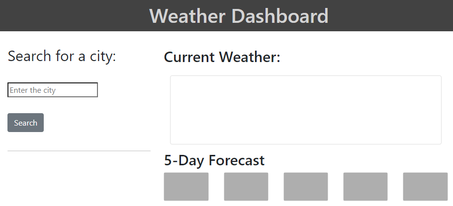
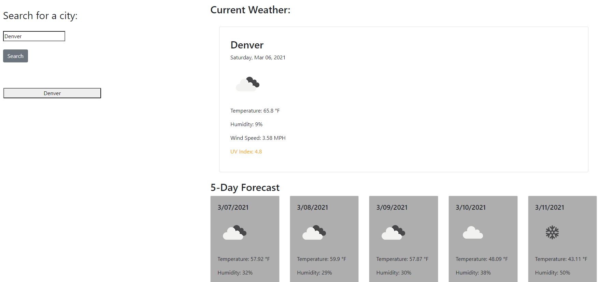
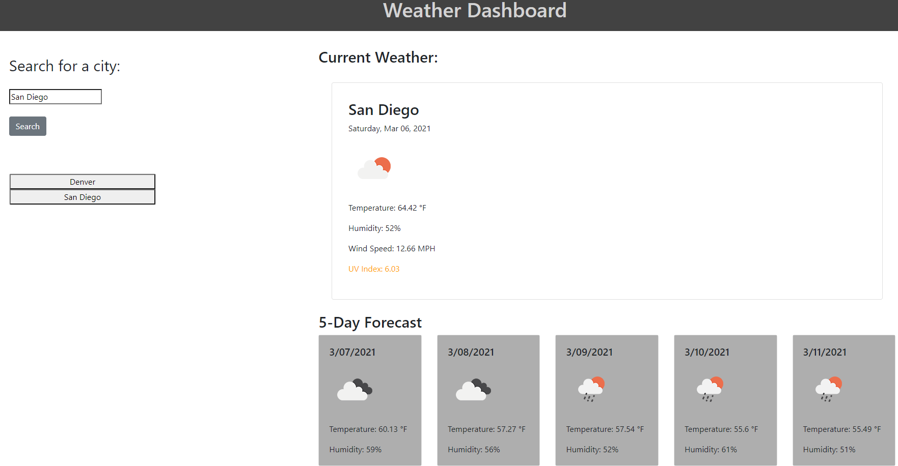

# Weather-Application

https://kristenpicard.github.io/Weather-Application/

## Description 

In this project I created a Weather Application.

Features of the scheduler:

When the user searches the name of a city, the current weather of that city is displayed along with the forecast of the upcoming 5 days in that city.

Additionally, when the user searches the name of a city that city is stored in a button below the search field.

This allows the user to click on cities they have already searched and displays the cooresponding current and 5-day forecast from that city.

This screenshot shows the page when it loads:
 

 
This screenshot shows what is displayed when the user searches for the city, "Denver":
 

 
This screenshot shows what is displayed as the user searches for an additional city, "San Diego":
 

